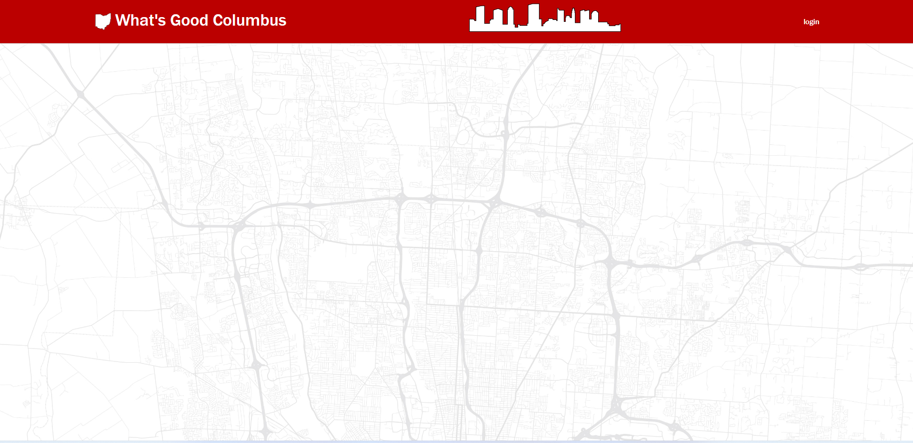
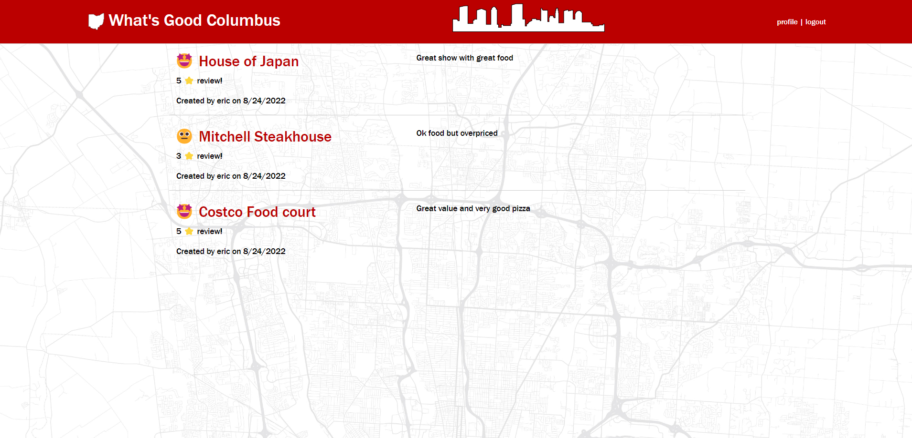

# Project_2

# What's good Columbus?

## Description

Columbus, Ohio is a great place to live and explore.  This Blog allows anyone to put in their experience with anything including events, dining or places that they visit.  It will let you to add the events or places you personally experienced and added to the homepage.  In order to put in your experience, you will need to create user id and password.  Once your account is set, it will allow you to create new post or add addition comment to post already made by other.  

## Usage

   

   

## Features

This project was done as full stack project which we used MySQL, Sequelize, Express, Handlebars, Node.js and Javascript.  

## Future enhancement

We are planning to add geo location for the post listed.  Also will be adding API that can look up events date and cancellation.  Further more, we will be spliting them into 3 different categorize that will make it easier for user to use and search for post with a new search box.  

## Credits

Deidre Carson
Email: deidre.carson@outlook.com

Annie Hoang
Email: anniehoang.anh@gmail.com

Nick Strang
Email: Strangn10@gmail.com

Vincent Dejulius
Email: dejuliusvince@gmail.com

Eric Shek
Email: ericshek23@yahoo.com
